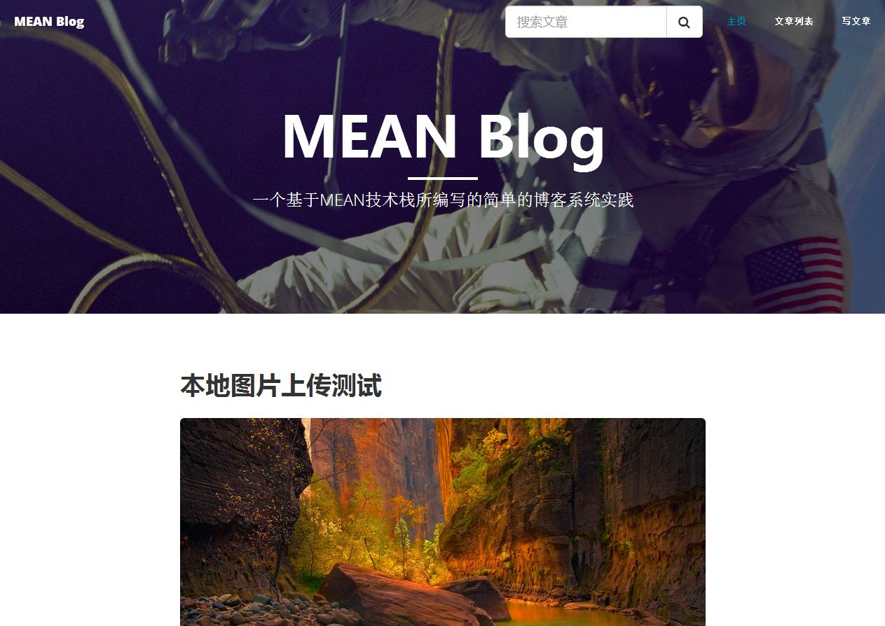

# MEAN Blog
### 一个用MEAN技术栈实践的简单的博客项目

---

#### 本程序所使用的技术栈
- 服务端
    - 数据库: `Mongodb` + `Mongoose`
    - `Express` + `ejs`
    - `Node.js`
    - `co` + `ES6`
    - ...
- 客户端
    - `AngularJS` + `UI-Router`
    - `jQuery`
    - `Bootstrap`
    - `Sass`
    - `Babel`
    - ...
- 构建工具
    - `Gulp`
    - ...
    
#### 已实现的功能
- 文章列表展示 + 分页浏览(主页)
- 文章搜索
- 文章管理(删除)
- 文章发布
- 文章支持使用Markdwon编辑
- Markdown本地图片上传
- 上传图片资源引用管理
- 第三方网络视频嵌入
- ...

---

以下是屏幕截图:

